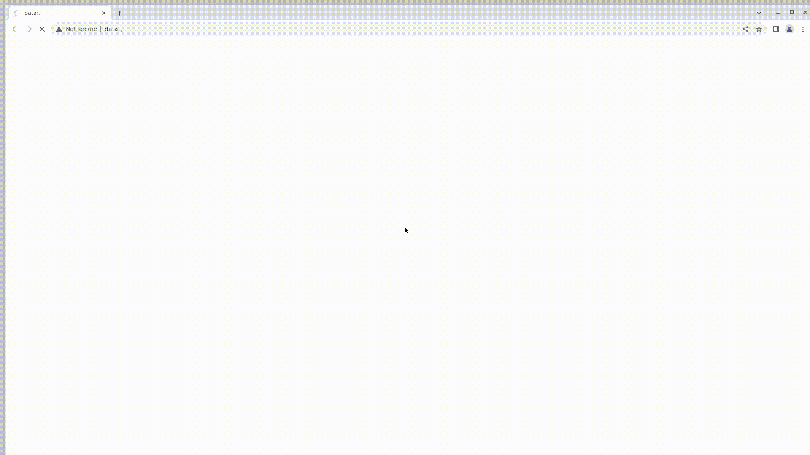

# Демопроект по автоматизации тестирования для сайта [Самокат](https://samokat.ru/)

> **Самокат** — сервис по доставке продуктов  

## :page_facing_up: Содержание:
Технологии и инструменты  
Реализованные проверки  
Сборка в Jenkins  
Параметры сборки в Jenkins  
Пример Allure отчета  
Уведомления в Telegram с использованием бота  

## :computer: Технологии и инструменты:

  
  
  
  
  
  
  
  

  

## :white_check_mark: Реализованные проверки:
Проверка элементов в хедере страницы  
Проверка элементов в боковом меню страницы  
Проверка основных разделов страницы  
Проверка элементов в футере страницы  
Параметризированная проверка поиска по каталогу  
Проверка страницы логина  

## :arrow_forward: Сборка в Jenkins:
Перейти по [ссылке](https://jenkins.autotests.cloud/job/C32-nechaevanatalya-lesson14/)

Для запуска сборки необходимо кликнуть на "Build with parameters"

## :label: Параметры сборки в Jenkins:
browser (браузер, по умолчанию chrome)  
browserVersion (версия браузера, по умолчанию 122)  
browserSize (размер окна браузера, по умолчанию 1920x1080)  

## :bar_chart: Пример Allure отчета:

Для просмотра перейти по [ссылке](https://jenkins.autotests.cloud/job/C32-nechaevanatalya-lesson14/10/)

Результат выполнения тестов:

Видео с выполнением одного из тестов:

## :bell: Уведомления в Telegram с использованием бота:
После завершения сборки Telegram-бот автоматически обрабатывает и отправляет сообщение с отчетом о прогоне тестов

